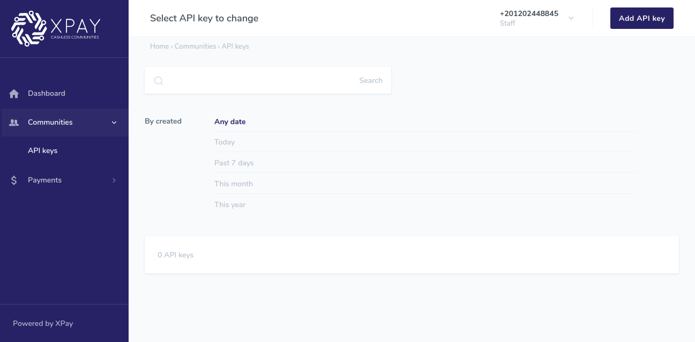
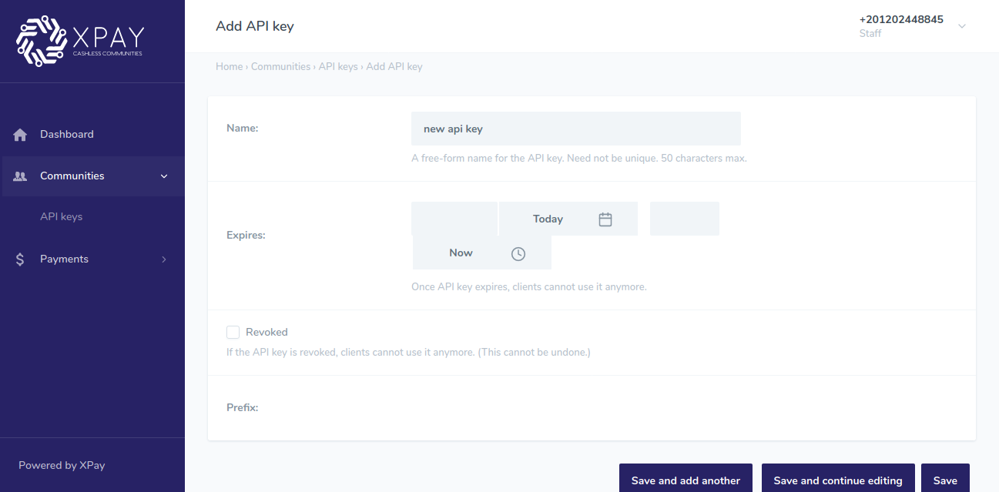

# 1. prepare amount

  

Note: depending on the agreement with XPay, if the service fees are **included in bill**, skip this step.

  

# Description

  

this endpoint takes an amount in **piasters**  `<amount_piasters>` and a community id `<community_id>`,

  

and calculates the service fees added to the amount.

  

-  ## URL

  

		https://develop.xpay.app/api/payments/prepare-amount/

  

-  ## Method

  

		POST

  
  

-  ## Body Params

		{ "amount_piasters": 100, "community_id": 1}

  

Notes:

  

-  `<community_id>`, is an ID that references prefrences to your community, it must always be present and of value that your community recieved from XPay.

  

-  `<amount_piasters>`, is the amount that represents the service cost without service fees and must be entered in **piasters**(integer).

  
  

-  ## Response body

  

If the POST request was successful, it will return `<totaL_amount_piasters>` which is the service cost with service fees included, save the value returned in `<total_amount_piasters>` as you will use it later.

  
	{
		"status": {
			"code": 200,
			"message": "success",
			"errors": []
		},

		"data": {
			"total_amount_piasters": 101.14
		},
		"count": null,
		"next": null,
		"previous": null
	}
		  
  

# 2. Variable amount template

  

1. Navigate to XPay community admin dashboard and login with the url and credentials that your community recieved later.

  

2. Navigate to **variable amount templates** under **payments** section in the side menu.

  

  
  

3. Click on **add variable amount** button in the top right corner.

  

4. Fill in the name and description that describe your payment type.

  

5. check **Is active** option.

  

6. uncheck **Require member id**.

  

7. click **Save**.

  

8. you will be redirected back to **variable amount templates**, the new created template will appear.

  

9. save the value in the **ID** column for later.

  

  
  
  

# 3. API key

1. Navigate to **API keys** under **payments** communities in the side menu.

  

  

2. Click on **add API key** button in the top right corner.

  

3. Fill in the name.

  
  

4. click **Save**, you will be redirected back to **API keys**.

  

5. copy the api key value from the message that appears in the top and save it safely as it can't be retrieved later.

  

  
  
  

# 4. pay endpoint

  

# Description

  

​

  

This endpoint will take required payment info and pass them to our Core Payment API and return the resultant response.

  

<!-- After the payment cycle ends, the user will be redirected to the url filled while creating the variable amount template and will return member id and transaction id as query paramaters. -->

  
  

​

  

-  ## URL

  

		https://develop.xpay.app/api/payments/pay/variable-amount

  

​

  

-  ## Method

  

		POST

  

​

  

-  ## Header Params

  

		x-api-key : <api-key>

​
Note: replace `<api-key>` with the api key you generated in [the third step](#3-api-key)

  

-  ## Body Params

  

	
  
  
  

Notes:

  
  

-  `<amount_piasters>`, is the amount that will be debited from your community's member in **piasters**, if your community fees is included in bill then use the value returned from [prepare amount step](#1-prepare-amount) , otherwise use the amount you want to charge the member directly in **piasters**.

  

- The `<name>` field's value must contain first and last name in **english letters** with space between them.

  

-  `<phone_number>` field's value **must contain country code** prefixed

  

-  `<variable_amount_id>`, is an ID that references to the variable amount template you created in [variable amount template step](#2-variable-amount-template).

  

-  `<community_id>`, is an ID that references prefrences to your community, it must always be present and of value that your community recieved.

  
  
  
  
  

-  ## Response body

  

If the POST request was successful, it will return an iframe url along with the transactionn id like in this example that the user can proceed with the payment process at.

	{
		"status": {
			"code": 200,
			"message": "success",
			"errors": []
		},
		"data": {
			"transaction_id": "null",
			"iframe_url": "https://dev-payment.xpay.app/core/payment_iframe/2733/",
			"transaction_uuid": "79685f71-f089-42d5-9159-7feb7966c590"
		},
		"count": null,
		"next": null,
		"previous": null
	}